# TerraCorder Database Schema

This document describes the relational database structure used by TerraCorder to track Terraform test dependencies.

## Overview

TerraCorder uses a **12-table normalized relational database** with comprehensive foreign key relationships. The database tracks all aspects of test dependencies including:
- Direct resource usage
- Template function call chains
- Sequential test patterns
- Test configuration references

All data is stored in-memory during processing and exported to CSV files for persistence and analysis.

## Multi-Resource Support

TerraCorder supports analyzing **multiple resources in a single database**:
- **Single Resource Mode**: `-ResourceName "azurerm_subnet"` creates database with ResourceRefId = 1
- **Multi-Resource Mode**: `-ResourceNames @("azurerm_subnet","azurerm_virtual_network")` creates database with ResourceRefId = 1, 2, etc.
- **Pull Request Mode**: `-PullRequest "1234"` auto-discovers resources from PR and assigns sequential ResourceRefIds

When multiple resources are analyzed, the `Resources` table contains all resources, and the `Services`, `Structs`, `TestFunctions`, and `TemplateFunctions` tables use `ResourceRefId` foreign keys to link records to their respective resources. This allows querying, filtering, and analysis by specific resource while maintaining relational integrity.

## Operational Modes

TerraCorder operates in two distinct modes:

### Discovery Mode (Database Creation)
- **Purpose**: Initial analysis of Terraform provider repository
- **Process**: 8-phase analysis creating complete relational database
- **Output**: 11 CSV files representing normalized database tables
- **File**: `go_test_commands.txt` with generated test commands
- **Duration**: Minutes (depends on repository size and resource complexity)
- **Use Case**: First-time analysis, updating database with code changes

### Database Mode (Query Operations)
- **Purpose**: Fast querying of previously analyzed data
- **Process**: Load CSV files into in-memory database, execute queries
- **Input**: CSV files from previous Discovery Mode run
- **Operations**: ShowDirectReferences, ShowIndirectReferences, ShowSequentialReferences, ShowCrossFileReferences, ShowAllReferences
- **Duration**: Seconds (5-10 seconds for database load, instant queries)
- **Use Case**: Analysis, reporting, exploration without re-scanning repository
- **Note**: Database Mode does not regenerate `go_test_commands.txt` (read-only operations)

## Design Principles

### Unified Lookup Table Strategy
This schema uses a **single ReferenceTypes table** (IDs 1-12) to serve multiple analytical dimensions:

- **Reference Resolution Method** (IDs 1-10): HOW a struct reference is resolved
  - Used in `ReferenceTypeId` field across multiple tables
  - Examples: SELF_CONTAINED, CROSS_FILE, EMBEDDED_SELF, etc.

- **Struct Visibility Classification** (IDs 11-12): Go language visibility rules
  - Used in `StructVisibilityTypeId` field in TestFunctionSteps
  - Examples: PRIVATE_REFERENCE (lowercase), PUBLIC_REFERENCE (uppercase)

### Why Not Separate Tables?
- **Consistency**: Single lookup table for all classification schemes
- **Simplicity**: No need to manage multiple small lookup tables
- **Extensibility**: Easy to add new reference types without schema changes
- **Performance**: Single foreign key constraint validation

### Key Separation of Concerns
- `ReferenceTypeId`: **HOW** was this reference resolved? (methodology)
- `StructVisibilityTypeId`: **WHAT** is the Go visibility level? (classification)

Both fields reference the same `ReferenceTypes` table but serve completely different analytical purposes.

### 1. ReferenceTypes Lookup Table (NEW)
```sql
CREATE TABLE ReferenceTypes (
    ReferenceTypeId INTEGER PRIMARY KEY,
    ReferenceTypeName TEXT UNIQUE NOT NULL
);

-- Master data
INSERT INTO ReferenceTypes VALUES (1, 'SELF_CONTAINED');        -- Used in: TestFunctionSteps, IndirectConfigReferences
INSERT INTO ReferenceTypes VALUES (2, 'CROSS_FILE');            -- Used in: TestFunctionSteps, IndirectConfigReferences
INSERT INTO ReferenceTypes VALUES (3, 'EMBEDDED_SELF');         -- Used in: IndirectConfigReferences
INSERT INTO ReferenceTypes VALUES (4, 'ATTRIBUTE_REFERENCE');   -- Used in: DirectResourceReferences
INSERT INTO ReferenceTypes VALUES (5, 'RESOURCE_REFERENCE');    -- Used in: DirectResourceReferences
INSERT INTO ReferenceTypes VALUES (6, 'DATA_SOURCE_REFERENCE'); -- Used in: DirectResourceReferences
INSERT INTO ReferenceTypes VALUES (7, 'TEMPLATE_FUNCTION');     -- Used in: IndirectConfigReferences (template function refs)
INSERT INTO ReferenceTypes VALUES (8, 'SEQUENTIAL_REFERENCE');  -- Used in: TestFunctionSteps (sequential pattern marker & map-based sequential test functions)
INSERT INTO ReferenceTypes VALUES (9, 'ANONYMOUS_FUNCTION_REFERENCE'); -- Used in: TestFunctionSteps (anonymous function references that are inherently private)
INSERT INTO ReferenceTypes VALUES (10, 'EXTERNAL_REFERENCE');   -- Used in: TestFunctionSteps (external dependencies not in our locally cached codebase)
INSERT INTO ReferenceTypes VALUES (11, 'PRIVATE_REFERENCE');    -- Used in: TestFunctionSteps (Go private struct visibility - lowercase first letter)
INSERT INTO ReferenceTypes VALUES (12, 'PUBLIC_REFERENCE');     -- Used in: TestFunctionSteps (Go public struct visibility - uppercase first letter)
INSERT INTO ReferenceTypes VALUES (13, 'SEQUENTIAL_ENTRYPOINT'); -- Used in: TestFunctionSteps (functions that are entry points for sequential test patterns)
INSERT INTO ReferenceTypes VALUES (14, 'SAME_SERVICE');         -- Used in: TestFunctionSteps (test and template in same service - service impact classification)
INSERT INTO ReferenceTypes VALUES (15, 'CROSS_SERVICE');        -- Used in: TestFunctionSteps (test uses template from different service - service impact classification)
```

**Note on Database Import**: ReferenceTypes are statically initialized in the Database module at startup. During Database Mode import, the ReferenceTypes.csv file is validated for existence but not imported since the values are already present. This optimization eliminates unnecessary I/O and memory allocation during database initialization.

#### Reference Type Definitions:
- **SELF_CONTAINED (1):** Reference resolved within the same file where struct is defined
- **CROSS_FILE (2):** Reference points to struct defined in a different file within same service
- **EMBEDDED_SELF (3):** Reference is embedded within the same struct definition (method calls)
- **ATTRIBUTE_REFERENCE (4):** Reference to struct attributes or nested properties
- **RESOURCE_REFERENCE (5):** Reference to Terraform resource instances
- **DATA_SOURCE_REFERENCE (6):** Reference to Terraform data source instances
- **TEMPLATE_FUNCTION (7):** Reference found in template functions or configurations
- **SEQUENTIAL_REFERENCE (8):** Reference found in sequential test step execution patterns (both direct function calls and map-based sequential test functions where lowercase testAcc functions are stored in maps and executed sequentially by controlling TestAcc functions)
- **ANONYMOUS_FUNCTION_REFERENCE (9):** Reference to anonymous functions that are inherently private/unexported (always assigned PRIVATE_REFERENCE visibility)
- **SEQUENTIAL_ENTRYPOINT (13):** Functions that are entry points for sequential test patterns (replaces the magic number "0" in SequentialEntryPointRefId field)
- **EXTERNAL_REFERENCE (10):** Reference to external dependencies not in our locally cached codebase (legitimate test prerequisites from other providers/modules)
- **PRIVATE_REFERENCE (11):** Go private struct visibility - struct names starting with lowercase letter (private to package)
- **PUBLIC_REFERENCE (12):** Go public struct visibility - struct names starting with uppercase letter (exported from package)
- **SAME_SERVICE (14):** Service impact classification - test function and template function are in the same Azure service (e.g., recoveryservices test using recoveryservices template)
- **CROSS_SERVICE (15):** Service impact classification - test function uses template from a different Azure service (e.g., cognitive test using recoveryservices template via dependency)

## Database Tables

### 1. Resources Table (Master Resource Record)
```sql
CREATE TABLE Resources (
    ResourceRefId INTEGER PRIMARY KEY,
    ResourceName TEXT UNIQUE NOT NULL
);
```

**Purpose**: Master table containing all analyzed Azure resources (e.g., "azurerm_resource_group", "azurerm_virtual_network").

**Rationale**: This table serves as the master record for all resources in the database. TerraCorder supports both single-resource and multi-resource analysis:
- **Single Resource Mode**: One record with ResourceRefId = 1
- **Multi-Resource Mode**: Multiple records with sequential ResourceRefIds (1, 2, 3, ...)
- **Pull Request Mode**: Auto-discovered resources assigned sequential ResourceRefIds

**Foreign Key Usage**: The `ResourceRefId` field is referenced by multiple tables to establish the relationship between database entities and the resource being analyzed:

| Referencing Table | Purpose | Why ResourceRefId is Needed |
|-------------------|---------|------------------------------|
| **Services** | Azure services | Links service (e.g., "network") to the resource being analyzed |
| **Structs** | Test resource structs | Identifies which resource this struct represents |
| **TestFunctions** | Test functions | Associates test functions with the resource under test |
| **TemplateFunctions** | Template/config methods | Links configuration templates to the resource |

**Multi-Resource Benefits**:
- Analyze multiple resources in a single database run
- Query and filter by specific resource using ResourceRefId
- Maintain relational integrity across resources
- Generate combined test commands for all resources
- Export single database containing all analyzed resources

### 2. Services Table (Azure Service Directory)
```sql
CREATE TABLE Services (
    ServiceRefId INTEGER PRIMARY KEY,
    ResourceRefId INTEGER NOT NULL,
    Name TEXT UNIQUE NOT NULL,
    FOREIGN KEY (ResourceRefId) REFERENCES Resources(ResourceRefId)
);
```

**Purpose**: Represents Azure service directories in the Terraform provider (e.g., "network", "compute", "storage").

**Foreign Keys**:
- `ResourceRefId`: Links to Resources table (identifies which resource this service contains)

### 3. Files Table (Enhanced with Service FK)
```sql
CREATE TABLE Files (
    FileRefId INTEGER PRIMARY KEY,
    ServiceRefId INTEGER NOT NULL,
    FilePath TEXT NOT NULL,
    FileName TEXT NOT NULL,
    FileContent TEXT NOT NULL,
    FOREIGN KEY (ServiceRefId) REFERENCES Services(ServiceRefId)
);
```

### 4. Structs Table (Enhanced with File FK)
```sql
CREATE TABLE Structs (
    StructRefId INTEGER PRIMARY KEY,
    ResourceRefId INTEGER NOT NULL,
    FileRefId INTEGER NOT NULL,
    StructName TEXT NOT NULL,
    Line INTEGER NOT NULL,
    FOREIGN KEY (ResourceRefId) REFERENCES Resources(ResourceRefId),
    FOREIGN KEY (FileRefId) REFERENCES Files(FileRefId)
);
```

**Purpose**: Test resource structs that contain configuration methods (e.g., `ResourceGroupResource`, `VirtualNetworkResource`).

**Foreign Keys**:
- `ResourceRefId`: Links to Resources table (identifies which Azure resource this struct represents)
- `FileRefId`: Links to Files table (where struct is defined)

**Design Note**: Structs are the core organizational unit in Terraform provider tests. Each struct typically represents a specific Azure resource and contains template methods for generating test configurations.

### 5. TestFunctions Table (Enhanced with FKs)
```sql
CREATE TABLE TestFunctions (
    TestFunctionRefId INTEGER PRIMARY KEY,
    ResourceRefId INTEGER NOT NULL,
    FileRefId INTEGER NOT NULL,
    StructRefId INTEGER,  -- NULL for functions not in structs
    FunctionName TEXT NOT NULL,
    TestPrefix TEXT NOT NULL,
    Line INTEGER NOT NULL,
    SequentialEntryPointRefId INTEGER DEFAULT 0,
    FunctionBody TEXT NOT NULL,
    FOREIGN KEY (ResourceRefId) REFERENCES Resources(ResourceRefId),
    FOREIGN KEY (FileRefId) REFERENCES Files(FileRefId),
    FOREIGN KEY (StructRefId) REFERENCES Structs(StructRefId)
);
```

**Purpose**: Test functions that verify Azure resource behavior (e.g., `TestAccResourceGroup_basic`, `testAccResourceGroup_requiresImport`).

**Foreign Keys**:
- `ResourceRefId`: Links to Resources table (identifies which resource this test validates)
- `FileRefId`: Links to Files table (where test function is defined)
- `StructRefId`: Links to Structs table (struct context for the test, NULL for standalone functions)

**Design Note**: TestFunctions can be public entry points (`TestAcc*`) or private helper functions (`testAcc*`). The `SequentialEntryPointRefId` field links sequential test functions to their entry points.

**External Reference Stub Pattern**: During Phase 6 (Sequential References Population), if a sequential test references functions not in the database (from files outside the analysis scope), stub TestFunction records are created to maintain referential integrity:
- `Line = 0` (unknown location - marks as external stub)
- `FunctionBody = "EXTERNAL_REFERENCE"` (no actual code available)
- `FileRefId` = Same file where the reference was found (not where function is defined)
- `StructRefId` = Same struct as sibling functions in the sequential test (maintains pattern consistency)
- `SequentialEntryPointRefId` = The entry point function that referenced this external function (provenance tracking)
- Corresponding TestFunctionSteps record created with `ReferenceTypeId = 10 (EXTERNAL_REFERENCE)`

**Example**: When analyzing `azurerm_hdinsight_hbase_cluster`, the sequential test `TestAccHDInsightCluster_securityProfileSequential` references 5 functions. Only `testAccHDInsightHBaseCluster_securityProfile` is in our analysis scope (references our resource). The other 4 functions (`testAccHDInsightInteractiveQueryCluster_securityProfile`, etc.) are from different resource files not discovered in Phase 1. Stub records are created for these external functions to:
1. Maintain SequentialReferences FK integrity
2. Show complete sequential test structure in visualization
3. Clearly mark external cross-resource dependencies

**Query to identify external stubs**:
```sql
SELECT * FROM TestFunctions WHERE Line = 0 AND FunctionBody = 'EXTERNAL_REFERENCE'
```

### 6. TemplateFunctions Table (Enhanced with FKs)
```sql
CREATE TABLE TemplateFunctions (
    TemplateFunctionRefId INTEGER PRIMARY KEY,
    ResourceRefId INTEGER NOT NULL,
    FileRefId INTEGER NOT NULL,
    StructRefId INTEGER,  -- NULL for functions not in structs
    TemplateFunctionName TEXT NOT NULL,
    Line INTEGER NOT NULL,
    FunctionBody TEXT NOT NULL,
    ReceiverVariable TEXT,
    FOREIGN KEY (ResourceRefId) REFERENCES Resources(ResourceRefId),
    FOREIGN KEY (FileRefId) REFERENCES Files(FileRefId),
    FOREIGN KEY (StructRefId) REFERENCES Structs(StructRefId)
);
```

**Purpose**: Template/configuration functions that generate Terraform HCL configurations (e.g., `basic()`, `complete()`, `requiresImport()`).

**Foreign Keys**:
- `ResourceRefId`: Links to Resources table (identifies which resource this template configures)
- `FileRefId`: Links to Files table (where template function is defined)
- `StructRefId`: Links to Structs table (struct that owns this template method)

**Design Note**: TemplateFunctions are typically methods on resource structs (e.g., `r.basic()` where `r` is a `ResourceGroupResource`). The `ReceiverVariable` field captures the variable name used in method calls (e.g., "r", "testResource").

### 7. DirectResourceReferences Table (Enhanced with FK)
```sql
CREATE TABLE DirectResourceReferences (
    DirectRefId INTEGER PRIMARY KEY,
    FileRefId INTEGER NOT NULL,
    ReferenceTypeId INTEGER NOT NULL,
    Line INTEGER NOT NULL,
    Context TEXT NOT NULL,
    FOREIGN KEY (FileRefId) REFERENCES Files(FileRefId),
    FOREIGN KEY (ReferenceTypeId) REFERENCES ReferenceTypes(ReferenceTypeId)
);
```

### 8. TestFunctionSteps Table (NEW - Complete Step Analysis)
```sql
CREATE TABLE TestFunctionSteps (
    TestFunctionStepRefId INTEGER PRIMARY KEY,
    TestFunctionRefId INTEGER NOT NULL,
    StepIndex INTEGER NOT NULL,                   -- 1, 2, 3... for multiple steps per function
    StepBody TEXT NOT NULL,                       -- Full step content or "SEQUENTIAL_PATTERN"
    ConfigTemplate TEXT,                          -- "r.basicConfig", "testResource.updateConfig", etc.
    StructRefId INTEGER,                          -- FK to Structs (if struct detected in step)
    ReferenceTypeId INTEGER NOT NULL,             -- FK to ReferenceTypes (resolution method)
    StructVisibilityTypeId INTEGER,               -- FK to ReferenceTypes (Go struct visibility: PRIVATE_REFERENCE=11, PUBLIC_REFERENCE=12)
    ServiceImpactTypeId INTEGER,                  -- FK to ReferenceTypes (service boundary classification: SAME_SERVICE=14, CROSS_SERVICE=15)
    FOREIGN KEY (TestFunctionRefId) REFERENCES TestFunctions(FunctionRefId),
    FOREIGN KEY (StructRefId) REFERENCES Structs(StructRefId),
    FOREIGN KEY (ReferenceTypeId) REFERENCES ReferenceTypes(ReferenceTypeId),
    FOREIGN KEY (StructVisibilityTypeId) REFERENCES ReferenceTypes(ReferenceTypeId),
    FOREIGN KEY (ServiceImpactTypeId) REFERENCES ReferenceTypes(ReferenceTypeId)
);
```

**Key Design Notes:**
- **ReferenceTypeId:** Tracks HOW the struct reference was resolved
  - Values 1-10: SELF_CONTAINED, CROSS_FILE, EMBEDDED_SELF, SEQUENTIAL_REFERENCE, etc.
  - Answers: "What method was used to resolve this struct reference?"

- **StructVisibilityTypeId:** Tracks Go struct visibility classification
  - Values 11-12: PRIVATE_REFERENCE (lowercase first letter), PUBLIC_REFERENCE (uppercase first letter)
  - Answers: "Is this struct private or public according to Go naming conventions?"

- **StructVisibilityTypeId Implementation Rules:** The visibility classification is determined during step creation using the following logic:
  - **EXTERNAL_REFERENCE Detection:** Some references are marked as EXTERNAL_REFERENCE (10) for both ReferenceTypeId and StructVisibilityTypeId
    - Applied when cross-file references are determined to be external dependencies
    - **Phase 6 Sequential Stub Creation:** When sequential tests reference functions not in the database (from files outside analysis scope), stub TestFunctionSteps records are created:
      - `StepBody = "EXTERNAL_REFERENCE"`
      - `ReferenceTypeId = 10 (EXTERNAL_REFERENCE)` - marks the step as external
      - `StructVisibilityTypeId = 10 (EXTERNAL_REFERENCE)` - marks visibility as external
      - `StructRefId = NULL` - no struct context available
      - Paired with stub TestFunction record where `Line = 0` and `FunctionBody = "EXTERNAL_REFERENCE"`
    - These represent legitimate test prerequisites from other resources/services not in the analysis scope
    - Example: When analyzing `azurerm_hdinsight_hbase_cluster`, sequential test references functions for `interactive_query`, `hadoop`, `kafka`, `spark` clusters
  - **ANONYMOUS_FUNCTION_REFERENCE (ReferenceTypeId=9):** Always assigned PRIVATE_REFERENCE (11)
    - Rationale: Anonymous functions are inherently private/unexported in Go
    - Applied during initial step creation in TestFunctionStepsProcessing.psm1
  - **Lowercase Function Names:** Assigned PRIVATE_REFERENCE (11)
    - Detection: First character of FunctionName is lowercase (using Go naming conventions)
    - Example: `testAccResourceBasic` → PRIVATE_REFERENCE
  - **CROSS_FILE References (ReferenceTypeId=2):** Follow standard Go visibility rules with special external handling
    - **External Detection:** CROSS_FILE references with empty/null/zero `StructRefId` → EXTERNAL_REFERENCE (10)
      - Condition: `StructRefId` is null, empty string, or "0" (indicating unresolved struct reference)
      - Rationale: These represent legitimate external dependencies not found in the locally cached codebase
      - Applied during Phase 4a.7 referential integrity cleanup
    - **Resolved References:** CROSS_FILE references with valid `StructRefId` follow Go naming conventions
      - Lowercase function names → PRIVATE_REFERENCE (11)
      - Uppercase function names → PUBLIC_REFERENCE (12)
  - **All Other Cases:** Assigned PUBLIC_REFERENCE (12) as default
    - Includes uppercase function names and most standard references
    - Example: `TestAccResourceBasic` → PUBLIC_REFERENCE

- **Dual-Purpose Foreign Key:** Both fields reference `ReferenceTypes(ReferenceTypeId)` but use different ID ranges
  - Same lookup table, different analytical dimensions
  - Example: A private struct resolved via embedded self would have ReferenceTypeId=3, StructVisibilityTypeId=11

- **ServiceImpactTypeId:** Tracks whether template dependencies cross service boundaries (CRITICAL for blast radius analysis)
  - Values 14-15: SAME_SERVICE, CROSS_SERVICE
  - Answers: "Does this test function depend on templates from other Azure services?"
  - **Purpose**: Identify cross-service dependencies for comprehensive impact analysis

**ServiceImpactTypeId Implementation Rules:**
- **SAME_SERVICE (14):** Test function and its template dependencies are ALL within the same Azure service
  - Example: `internal/services/recoveryservices/recovery_services_vault_test.go` test calling `r.basic()` template in same file
  - Rationale: Changes to templates only affect tests in the same service
  - Service boundary: Determined by comparing Files.ServiceRefId between test and template

- **CROSS_SERVICE (15):** Test function uses templates that reference resources from DIFFERENT Azure services
  - Example: `internal/services/cognitive/cognitive_account_rai_blocklist_test.go` test calling template that uses `azurerm_recovery_services_vault`
  - Detection chain:
    1. TestFunction → TestFunctionStep → TemplateReference → IndirectConfigReference → TemplateFunction
    2. Compare TestFunction.FileRefId → Files.ServiceRefId with TemplateFunction.FileRefId → Files.ServiceRefId
    3. If ServiceRefIds differ → CROSS_SERVICE, else SAME_SERVICE
  - **Critical for Impact Analysis**: Shows which external services depend on your resource
  - **Use case**: "If I change azurerm_recovery_services_vault, which OTHER services' tests might break?"

**Why ServiceImpactTypeId Matters:**
When running terracorder on `azurerm_recovery_services_vault`, you might discover:
- **SAME_SERVICE tests** (recoveryservices): 26 test prefixes - these directly test the vault
- **CROSS_SERVICE tests** (cognitive, network, etc.): 11 additional services - these use vault as a dependency

The CROSS_SERVICE classification reveals hidden blast radius:
- Cognitive service tests create vaults in their templates for testing AI features
- Network service tests create vaults for testing private endpoints
- These aren't testing the vault itself, but DEPEND on it working correctly

Without ServiceImpactTypeId, you'd miss these dependencies and potentially break unrelated services!

**Query Examples:**
```powershell
# Find all cross-service dependencies
$steps | Where-Object { $_.ServiceImpactTypeId -eq 15 }

# Find which external services depend on my resource
$steps | Where-Object { $_.ServiceImpactTypeId -eq 15 } |
  Join-Object Files.ServiceRefId |
  Group-Object ServiceName
```

- **Triple-Purpose Foreign Key Pattern:** TestFunctionSteps uses ReferenceTypes for THREE different classifications
  - `ReferenceTypeId`: HOW was the reference resolved? (SELF_CONTAINED, CROSS_FILE, EMBEDDED_SELF)
  - `StructVisibilityTypeId`: WHAT is the Go visibility? (PRIVATE_REFERENCE, PUBLIC_REFERENCE)
  - `ServiceImpactTypeId`: DOES it cross service boundaries? (SAME_SERVICE, CROSS_SERVICE)
  - All reference the same `ReferenceTypes(ReferenceTypeId)` but use different ID ranges (1-13, 11-12, 14-15)
  - This maintains consistency while allowing multiple analytical dimensions

- **Maintains Separation of Concerns:** Resolution method vs. visibility classification are independent concepts

### 9. TemplateReferences Table (Enhanced with Step FK)
```sql
CREATE TABLE TemplateReferences (
    TemplateReferenceRefId INTEGER PRIMARY KEY,
    TestFunctionRefId INTEGER NOT NULL,
    TestFunctionStepRefId INTEGER NOT NULL,       -- NEW: FK to TestFunctionSteps instead of StepNumber
    StructRefId INTEGER,
    TemplateReference TEXT NOT NULL,              -- "r.basic", "testResource.updateConfig"
    TemplateVariable TEXT,                        -- "r", "testResource"
    TemplateMethod TEXT,                          -- "basic", "updateConfig"
    FOREIGN KEY (TestFunctionRefId) REFERENCES TestFunctions(FunctionRefId),
    FOREIGN KEY (TestFunctionStepRefId) REFERENCES TestFunctionSteps(TestFunctionStepRefId),
    FOREIGN KEY (StructRefId) REFERENCES Structs(StructRefId)
);
```

### 10. IndirectConfigReferences Table (REDESIGNED - No More Content Crawling!)
```sql
CREATE TABLE IndirectConfigReferences (
    IndirectRefId INTEGER PRIMARY KEY,
    TemplateReferenceRefId INTEGER NOT NULL,
    SourceTemplateFunctionRefId INTEGER NOT NULL,  -- FK to TemplateFunctions
    ReferenceTypeId INTEGER NOT NULL,
    ServiceImpactTypeId INTEGER,                   -- FK to ReferenceTypes (14=SAME_SERVICE, 15=CROSS_SERVICE)
    FOREIGN KEY (TemplateReferenceRefId) REFERENCES TemplateReferences(TemplateReferenceRefId),
    FOREIGN KEY (SourceTemplateFunctionRefId) REFERENCES TemplateFunctions(TemplateFunctionRefId),
    FOREIGN KEY (ReferenceTypeId) REFERENCES ReferenceTypes(ReferenceTypeId),
    FOREIGN KEY (ServiceImpactTypeId) REFERENCES ReferenceTypes(ReferenceTypeId)
);
```

**ServiceImpactTypeId Classification:**
- **SAME_SERVICE (14):** Template function is in the same Azure service as the target resource
  - Example: `recoveryservices` template using `azurerm_recovery_services_vault` (both in recoveryservices service)
  - Pattern: Template's ServiceRefId (via Files.ServiceRefId) matches resource's owning service
  - Impact: Changes to resource affect tests within the same service boundary

- **CROSS_SERVICE (15):** Template function is in a different Azure service than the target resource
  - Example: `cognitive` template using `azurerm_recovery_services_vault` (cognitive ≠ recoveryservices)
  - Pattern: Template's ServiceRefId differs from resource's owning service
  - Impact: Changes to resource have cross-service blast radius - affects tests in other services
  - Critical for: Comprehensive impact analysis, identifying hidden dependencies

**Classification Process (Phase 5.5):**
1. Find resource definition file by pattern: `*{resource_name}_resource*.go`
2. Get owning service via `Get-ServiceRefIdByFilePath` (O(1) indexed lookup)
3. For each IndirectConfigReference:
   - Get template function → file → ServiceRefId
   - Compare template's ServiceRefId with resource's ServiceRefId
   - Classify as SAME_SERVICE or CROSS_SERVICE

**Discovery Results Example (azurerm_recovery_services_vault):**
- 224 SAME_SERVICE: recoveryservices templates
- 137 CROSS_SERVICE: templates from cognitive, network, systemcentervirtualmachinemanager, etc.


### 11. SequentialReferences Table
```sql
CREATE TABLE SequentialReferences (
    SequentialRefId INTEGER PRIMARY KEY,
    EntryPointFunctionRefId INTEGER NOT NULL,
    ReferencedFunctionRefId INTEGER NOT NULL,
    SequentialGroup TEXT NOT NULL,
    SequentialKey TEXT NOT NULL,
    FOREIGN KEY (EntryPointFunctionRefId) REFERENCES TestFunctions(TestFunctionRefId),
    FOREIGN KEY (ReferencedFunctionRefId) REFERENCES TestFunctions(TestFunctionRefId)
);
```

**Purpose**: Links sequential test entry points to their referenced test functions (e.g., `acceptance.RunTestsInSequence` patterns).

**Foreign Keys**:
- `EntryPointFunctionRefId`: The main test function that orchestrates sequential execution
- `ReferencedFunctionRefId`: The actual test function being called sequentially

**External Reference Handling (Phase 6)**: During sequential reference population, if a sequential test references functions not in the TestFunctions table (from files outside analysis scope), stub TestFunction records are automatically created to maintain referential integrity. This ensures ALL sequential groups/keys are captured, even if they reference other resources.

**Example - Cross-Resource Sequential Test**:
```go
// Entry point in hdinsight_cluster_resource_test.go
func TestAccHDInsightCluster_securityProfileSequential(t *testing.T) {
    acceptance.RunTestsInSequence(t, map[string]map[string]func(t *testing.T){
        "interactiveQuery": {"securityProfile": testAccHDInsightInteractiveQueryCluster_securityProfile}, // EXTERNAL
        "hadoop":           {"securityProfile": testAccHDInsightHadoopCluster_securityProfile},           // EXTERNAL
        "hbase":            {"securityProfile": testAccHDInsightHBaseCluster_securityProfile},            // IN-SCOPE
        "kafka":            {"securityProfile": testAccHDInsightKafkaCluster_securityProfile},            // EXTERNAL
        "spark":            {"securityProfile": testAccHDInsightSparkCluster_securityProfile},            // EXTERNAL
    })
}
```

When analyzing `azurerm_hdinsight_hbase_cluster`:
- Only the `hbase` function is discovered (references our resource)
- The other 4 functions are in different files (reference different resources)
- **Phase 6 creates stub records** for the 4 external functions with matching relational chain
- **Result**: All 5 SequentialReferences records created, complete sequential structure visible

**Query to find external sequential references**:
```sql
SELECT sr.*, tf.FunctionName, tf.Line
FROM SequentialReferences sr
JOIN TestFunctions tf ON sr.ReferencedFunctionRefId = tf.TestFunctionRefId
WHERE tf.Line = 0 AND tf.FunctionBody = 'EXTERNAL_REFERENCE'
```

**Why Sequential References Matter for Impact Analysis:**

Sequential references are the DISCOVERY MECHANISM that expands the blast radius beyond direct file references. They answer: "What other tests get pulled in because they're part of a sequential test chain?"

**The Complete Reference Chain - How A→B→C Works:**

```
DISCOVERY FLOW:
Phase 1: Direct Scan → Phase 3: Sequential Expansion → Phase 5: Template Dependencies

1. DIRECT SCAN (Phase 1)
   └─→ Find test: TestAccRecoveryServicesVault_basic
       └─→ Direct reference to azurerm_recovery_services_vault
       └─→ Creates DirectResourceReferences entry
       └─→ Marks file as "has this resource"

2. SEQUENTIAL EXPANSION (Phase 3)  ⬅️ THIS IS WHERE COGNITIVE TESTS ENTER
   └─→ Find sequential test: TestAccCognitiveRaiBlocklistSequential (FileRefId 1)
       ├─→ This test file has ZERO direct vault references!
       ├─→ But it calls RunTestsInSequence with multiple test functions
       └─→ One of those functions is TestAccCognitiveRaiBlocklist_update
           └─→ Creates SequentialReferences entry:
               - EntryPointFunctionRefId: 1 (TestAccCognitiveRaiBlocklistSequential)
               - ReferencedFunctionRefId: [varies] (TestAccCognitiveRaiBlocklist_update, etc.)
               - This is the LINK that connects cognitive tests to the vault chain

3. TEMPLATE DEPENDENCIES (Phase 5)  ⬅️ THIS IS WHERE VAULT ENTERS VIA TEMPLATES
   └─→ Analyze TestAccCognitiveRaiBlocklist_update test steps
       └─→ Test calls: r.complete(data) template
           ├─→ Creates TestFunctionSteps entry (ReferenceTypeId=1 CROSS_FILE)
           └─→ r.complete calls: c.template(data)
               ├─→ Creates TemplateReferences entry
               └─→ c.template contains: azurerm_recovery_services_vault resource!
                   └─→ Creates IndirectConfigReferences entry
                       - Links template to vault resource via string pattern match
                       - ServiceImpactTypeId=15 (CROSS_SERVICE)
                       - This is why cognitive tests appear in vault discovery!

RESULT: Cognitive tests included in azurerm_recovery_services_vault discovery because:
  TestAccCognitiveRaiBlocklistSequential (sequential entry point)
    → SequentialReferences →
  TestAccCognitiveRaiBlocklist_update (individual test)
    → TestFunctionSteps →
  r.complete (template function)
    → TemplateReferences →
  c.template (nested template)
    → IndirectConfigReferences →
  azurerm_recovery_services_vault (the resource!)
```

**Real-World Example - Tracing the Chain:**

Using `azurerm_recovery_services_vault` discovery, here's how to trace why `cognitive` service appears:

```powershell
# Step 1: Find sequential entry point in cognitive service
$files | Where-Object { $_.ServiceRefId -eq 6 }  # cognitive = ServiceRefId 6
# Result: FileRefId 1 = cognitive_account_rai_blocklist_test.go

# Step 2: What sequential test is the entry point?
$testFuncs | Where-Object { $_.FileRefId -eq 1 -and $_.FunctionName -like '*Sequential' }
# Result: TestFunctionRefId 1 = TestAccCognitiveRaiBlocklistSequential

# Step 3: What tests does it call?
$sequentialRefs | Where-Object { $_.EntryPointFunctionRefId -eq 1 }
# Result: 3 sequential references (update, requiresImport, complete)

# Step 4: Do any of those tests have template dependencies?
$steps = Import-Csv .\output\TestFunctionSteps.csv
$steps | Where-Object { $_.TestFunctionRefId -in (3,4,5) }
# Result: YES! TestFunctionRefId 3 (update test) calls template "r.complete"

# Step 5: What does that template reference?
$templateRefs = Import-Csv .\output\TemplateReferences.csv
$templateRefs | Where-Object { $_.CallingTestFunctionRefId -eq 3 }
# Result: TemplateRefId pointing to "c.template" function

# Step 6: What resources does c.template contain?
$indirectRefs = Import-Csv .\output\IndirectConfigReferences.csv
$indirectRefs | Where-Object { $_.TemplateRefId -eq [from step 5] }
# Result: azurerm_recovery_services_vault found in template!

# THE COMPLETE CHAIN:
# TestAccCognitiveRaiBlocklistSequential (entry point, FileRefId 1)
#   → [SequentialReferences]
# TestAccCognitiveRaiBlocklist_update (test, TestFunctionRefId 3)
#   → [TestFunctionSteps]
# r.complete (template call, CROSS_FILE reference)
#   → [TemplateReferences]
# c.template (nested template function)
#   → [IndirectConfigReferences]
# azurerm_recovery_services_vault (THE RESOURCE!)
```

**Key Insight:** Sequential references are the ENTRY POINT that allows tests from completely different services to be included in the discovery. Without SequentialReferences table, cognitive tests would NEVER be discovered because:
- Cognitive test file has ZERO direct vault references
- But it's part of a sequential test chain
- And one test in that chain uses a template
- And that template creates a vault resource

**Impact on go test Commands:**
The `Get-ServiceTestResults` function in SequentialProcessing.psm1 uses this chain to include cognitive service in the go test commands:
```powershell
# Joins: IndirectConfigReferences → TemplateReferences → TestFunctionSteps → TestFunctions → Files → Services
# Result: 11 services in go_test_commands.txt (not just the 4 with direct references!)
```

**Why This Matters:**
If you change `azurerm_recovery_services_vault`, you need to run tests from:
- **Direct services** (recoveryservices, dataprotection, etc.) - obvious impact
- **Sequential/Template services** (cognitive, network, etc.) - hidden impact discovered via this chain!

Without sequential reference tracking, you'd miss breaking changes in dependent services!

**Discovery Validation:**
This multi-phase discovery mechanism has been proven to be rock solid. It successfully finds ALL references to the resource name passed on the command line, including:
- ✅ Direct references (Phase 1) - tests that explicitly use the resource
- ✅ Sequential references (Phase 3) - tests pulled in via `RunTestsInSequence` patterns
- ✅ Indirect/Template references (Phase 5) - tests that use templates containing the resource

**Key Insight**: Tests can be included even when their file has ZERO direct references to the resource! The sequential entry point itself doesn't need to reference the resource - it just needs to call tests that eventually reference it via template dependencies. This comprehensive discovery ensures you never miss a potentially affected test.

## Foreign Key Relationship Diagram

### Complete Foreign Key Relationship Diagram (Mermaid ER Diagram)

```mermaid
erDiagram
    %% Master Table
    RESOURCES {
        int ResourceRefId PK
        string ResourceName
    }

    %% Core Tables
    SERVICES {
        int ServiceRefId PK
        int ResourceRefId FK
        string Name
    }

    FILES {
        int FileRefId PK
        int ServiceRefId FK
        string FilePath
        string FileName
        string FileContent
    }

    STRUCTS {
        int StructRefId PK
        int ResourceRefId FK
        int FileRefId FK
        string StructName
        int Line
    }

    %% Test and Template Functions
    TEST_FUNCTIONS {
        int TestFunctionRefId PK
        int ResourceRefId FK
        int FileRefId FK
        int StructRefId FK "nullable"
        string FunctionName
        string TestPrefix
        int Line
        int SequentialEntryPointRefId
        string FunctionBody
    }

    TEMPLATE_FUNCTIONS {
        int TemplateFunctionRefId PK
        int ResourceRefId FK
        int FileRefId FK
        int StructRefId FK "nullable"
        string TemplateFunctionName
        int Line
        string FunctionBody
        string ReceiverVariable
    }

    %% Step and Reference Tables
    TEST_FUNCTION_STEPS {
        int TestFunctionStepRefId PK
        int TestFunctionRefId FK
        int StepIndex
        string StepBody
        string ConfigTemplate
        int StructRefId FK "nullable"
        int ReferenceTypeId FK
        int StructVisibilityTypeId FK "nullable"
        int ServiceImpactTypeId FK "nullable"
    }

    TEMPLATE_REFERENCES {
        int TemplateReferenceRefId PK
        int TestFunctionRefId FK
        int TestFunctionStepRefId FK
        int StructRefId FK "nullable"
        string TemplateReference
        string TemplateVariable
        string TemplateMethod
    }

    DIRECT_RESOURCE_REFERENCES {
        int DirectRefId PK
        int FileRefId FK
        int ReferenceTypeId FK
        int Line
        string Context
    }

    INDIRECT_CONFIG_REFERENCES {
        int IndirectRefId PK
        int TemplateReferenceRefId FK
        int SourceTemplateFunctionRefId FK
        int ReferenceTypeId FK
        int ServiceImpactTypeId FK "nullable"
    }

    SEQUENTIAL_REFERENCES {
        int SequentialRefId PK
        int EntryPointFunctionRefId FK
        int ReferencedFunctionRefId FK
        string SequentialGroup
        string SequentialKey
    }

    %% Lookup Table
    REFERENCE_TYPES {
        int ReferenceTypeId PK
        string ReferenceTypeName
    }

    %% Primary Relationships from Resources (Master Table)
    RESOURCES ||--o{ SERVICES : "has"
    RESOURCES ||--o{ STRUCTS : "has"
    RESOURCES ||--o{ TEST_FUNCTIONS : "validates"
    RESOURCES ||--o{ TEMPLATE_FUNCTIONS : "configures"

    %% Service and File Relationships
    SERVICES ||--o{ FILES : "contains"
    FILES ||--o{ STRUCTS : "defines"
    FILES ||--o{ TEST_FUNCTIONS : "defines"
    FILES ||--o{ TEMPLATE_FUNCTIONS : "defines"
    FILES ||--o{ DIRECT_RESOURCE_REFERENCES : "contains"
    FILES ||--o{ TEST_FUNCTION_STEPS : "references"

    %% Struct Relationships
    STRUCTS ||--o{ TEST_FUNCTIONS : "context-for"
    STRUCTS ||--o{ TEMPLATE_FUNCTIONS : "owns-methods"
    STRUCTS ||--o{ TEST_FUNCTION_STEPS : "resolved-in"
    STRUCTS ||--o{ TEMPLATE_REFERENCES : "used-in"

    %% Test Function Relationships
    TEST_FUNCTIONS ||--o{ TEST_FUNCTION_STEPS : "has-steps"
    TEST_FUNCTIONS ||--o{ TEMPLATE_REFERENCES : "calls-templates"
    TEST_FUNCTIONS ||--o{ SEQUENTIAL_REFERENCES : "entry-point"
    TEST_FUNCTIONS ||--o{ SEQUENTIAL_REFERENCES : "referenced-by"

    %% Template Function Relationships
    TEMPLATE_FUNCTIONS ||--o{ INDIRECT_CONFIG_REFERENCES : "source-of"

    %% Test Function Steps Relationships
    TEST_FUNCTION_STEPS ||--o{ TEMPLATE_REFERENCES : "invokes"

    %% Template References Relationships
    TEMPLATE_REFERENCES ||--o{ INDIRECT_CONFIG_REFERENCES : "resolves-to"

    %% Reference Types Relationships (Lookup Table)
    REFERENCE_TYPES ||--o{ DIRECT_RESOURCE_REFERENCES : "classifies"
    REFERENCE_TYPES ||--o{ INDIRECT_CONFIG_REFERENCES : "classifies-reference"
    REFERENCE_TYPES ||--o{ INDIRECT_CONFIG_REFERENCES : "classifies-service-impact"
    REFERENCE_TYPES ||--o{ TEST_FUNCTION_STEPS : "method-type"
    REFERENCE_TYPES ||--o{ TEST_FUNCTION_STEPS : "visibility-type"
```



**Key Relationships:**

1. **Resources** (Master Table)
   - Referenced by: Services, Structs, TestFunctions, TemplateFunctions via `ResourceRefId`

2. **Services**
   - References: Resources via `ResourceRefId`
   - Referenced by: Files via `ServiceRefId`

3. **Files** (Central Hub)
   - References: Services via `ServiceRefId`
   - Referenced by: Structs, TestFunctions, TemplateFunctions, DirectResourceReferences via `FileRefId`

4. **Structs**
   - References: Resources via `ResourceRefId`, Files via `FileRefId`
   - Referenced by: TestFunctions, TemplateFunctions, TestFunctionSteps, TemplateReferences via `StructRefId`

5. **TestFunctions**
   - References: Resources via `ResourceRefId`, Files via `FileRefId`, Structs via `StructRefId`
   - Referenced by: TestFunctionSteps, TemplateReferences, SequentialReferences via `TestFunctionRefId`

6. **TemplateFunctions**
   - References: Resources via `ResourceRefId`, Files via `FileRefId`, Structs via `StructRefId`
   - Referenced by: IndirectConfigReferences via `SourceTemplateFunctionRefId`

7. **TestFunctionSteps**
   - References: TestFunctions via `TestFunctionRefId`, Structs via `StructRefId`, ReferenceTypes via `ReferenceTypeId` and `StructVisibilityTypeId`
   - Referenced by: TemplateReferences via `TestFunctionStepRefId`

8. **TemplateReferences**
   - References: TestFunctions via `TestFunctionRefId`, TestFunctionSteps via `TestFunctionStepRefId`, Structs via `StructRefId`
   - Referenced by: IndirectConfigReferences via `TemplateReferenceRefId`

9. **IndirectConfigReferences**
   - References: TemplateReferences via `TemplateReferenceRefId`, TemplateFunctions via `SourceTemplateFunctionRefId`, ReferenceTypes via `ReferenceTypeId` and `ServiceImpactTypeId`

10. **SequentialReferences**
    - References: TestFunctions via `EntryPointFunctionRefId` and `ReferencedFunctionRefId`

11. **DirectResourceReferences**
    - References: Files via `FileRefId`, ReferenceTypes via `ReferenceTypeId`

12. **ReferenceTypes** (Lookup Table)
    - Referenced by: DirectResourceReferences, IndirectConfigReferences (twice: ReferenceTypeId and ServiceImpactTypeId), TestFunctionSteps (twice: ReferenceTypeId and StructVisibilityTypeId)

### ResourceRefId Usage Pattern

**Tables with ResourceRefId Foreign Key:**
1. **Services** - Links Azure service directories to the resource under analysis
2. **Structs** - Links test resource structs to the specific Azure resource
3. **TestFunctions** - Links test functions to the resource they validate
4. **TemplateFunctions** - Links configuration templates to the resource they configure

**Current Implementation:**
- All ResourceRefId values = 1 (single resource analysis)
- Added during CSV export (Phase 8) on the cold path
- Enables future multi-resource analysis without schema changes

**Why Not All Tables?**
- **Files**: Linked via Services (indirect relationship through service directory)
- **TestFunctionSteps**: Linked via TestFunctions (steps belong to functions, functions belong to resources)
- **DirectResourceReferences**: Linked via Files (references found in files)
- **TemplateReferences**: Linked via TestFunctions (template calls within test functions)
- **IndirectConfigReferences**: Linked via TemplateReferences and TemplateFunctions (derived relationships)
- **SequentialReferences**: Linked via TestFunctions (both entry point and referenced functions)

## Key Benefits of Proper Relational Design

### 1. Eliminate Content Crawling
**OLD WAY (Content Crawling):**
```powershell
# Search file content for function names - O(N²) disaster!
$fileContent = Get-Content $filePath
foreach ($line in $fileContent) {
    if ($line -match $functionName) { ... }
}
```

**NEW WAY (Relational Queries):**
```sql
-- O(1) JOIN queries using existing relationships!
SELECT tf.TemplateFunctionRefId, tf.TemplateFunctionName, f.FilePath
FROM TemplateFunctions tf
JOIN Files f ON tf.FileRefId = f.FileRefId
WHERE tf.TemplateFunctionName = 'basic'
```

### 2. Eliminate Duplicate Data Storage
**OLD WAY (Duplicate Data):**
- Store `ReferenceType = "CROSS_FILE"` as TEXT in every row
- Store file paths and names in multiple places
- Repeat service names across tables

**NEW WAY (Foreign Keys):**
- Store `ReferenceTypeId = 2` pointing to lookup table
- Store `FileRefId` pointing to Files table
- Single source of truth for all data

### 3. Derive IndirectConfigReferences from Existing Data
**CURRENT APPROACH:** Content crawling to find template function references
**PROPER APPROACH:** Use existing relationships!

```sql
-- Derive CROSS_FILE references using existing table relationships
INSERT INTO IndirectConfigReferences (
    TemplateReferenceRefId,
    SourceTemplateFunctionRefId,
    ReferenceTypeId
)
SELECT
    tr.TemplateReferenceRefId,
    tf.TemplateFunctionRefId,
    2 as ReferenceTypeId  -- CROSS_FILE
FROM TemplateReferences tr
JOIN TestFunctions test_f ON tr.TestFunctionRefId = test_f.FunctionRefId
JOIN TemplateFunctions tf ON tf.TemplateFunctionName = tr.TemplateReference
JOIN Files test_file ON test_f.FileRefId = test_file.FileRefId
JOIN Files template_file ON tf.FileRefId = template_file.FileRefId
WHERE test_file.FileRefId != template_file.FileRefId;  -- Different files = CROSS_FILE
```

## Enhanced Query Patterns with TestFunctionSteps Integration

### 1. Complete Test Function Analysis with Step-Level Traceability

**Get all steps for any test function (regular or sequential):**
```sql
-- For regular test functions with inline steps
SELECT
    tf.FunctionName,
    tfs.StepIndex,
    tfs.StepBody,
    tfs.ConfigTemplate,
    rt.ReferenceTypeName,
    s.StructName
FROM TestFunctions tf
JOIN TestFunctionSteps tfs ON tf.FunctionRefId = tfs.TestFunctionRefId
LEFT JOIN Structs s ON tfs.StructRefId = s.StructRefId
JOIN ReferenceTypes rt ON tfs.ReferenceTypeId = rt.ReferenceTypeId
WHERE tf.FunctionName = 'TestAccWorkloadsSAP_update'
ORDER BY tfs.StepIndex;

-- For sequential test functions, get the pattern
SELECT
    tf.FunctionName,
    sr.SequentialKey,
    ref_tf.FunctionName as ReferencedFunction
FROM TestFunctions tf
JOIN TestFunctionSteps tfs ON tf.FunctionRefId = tfs.TestFunctionRefId
JOIN SequentialReferences sr ON tf.FunctionRefId = sr.EntryPointFunctionRefId
JOIN TestFunctions ref_tf ON sr.ReferencedFunctionRefId = ref_tf.FunctionRefId
WHERE tfs.ReferenceTypeId = 8  -- SEQUENTIAL_REFERENCE
AND tf.FunctionName = 'TestAccResourceGroup_basic'
ORDER BY sr.SequentialKey;
```

### 2. Three-Way Join: Test Steps → Template Functions → Actual Configurations

**Complete traceability from test step to template function to configuration:**
```sql
SELECT
    tf.FunctionName as TestFunction,
    tfs.StepIndex,
    tfs.ConfigTemplate,
    tr.TemplateReference,
    tmpl_f.TemplateFunctionName,
    tmpl_file.FilePath as TemplateFilePath,
    icr.ReferenceTypeId,
    rt.ReferenceTypeName
FROM TestFunctions tf
JOIN TestFunctionSteps tfs ON tf.FunctionRefId = tfs.TestFunctionRefId
JOIN TemplateReferences tr ON tfs.TestFunctionStepRefId = tr.TestFunctionStepRefId
JOIN IndirectConfigReferences icr ON tr.TemplateReferenceRefId = icr.TemplateReferenceRefId
JOIN TemplateFunctions tmpl_f ON icr.SourceTemplateFunctionRefId = tmpl_f.TemplateFunctionRefId
JOIN Files tmpl_file ON tmpl_f.FileRefId = tmpl_file.FileRefId
JOIN ReferenceTypes rt ON icr.ReferenceTypeId = rt.ReferenceTypeId
WHERE tf.FunctionName = 'TestAccWorkloadsSAP_update'
ORDER BY tfs.StepIndex;
```

### 3. Advanced Analytics Queries

**Test complexity analysis by step count:**
```sql
-- Regular functions complexity
SELECT
    tf.FunctionName,
    COUNT(tfs.TestFunctionStepRefId) as StepCount,
    COUNT(CASE WHEN tfs.ReferenceTypeId = 2 THEN 1 END) as CrossFileSteps
FROM TestFunctions tf
JOIN TestFunctionSteps tfs ON tf.FunctionRefId = tfs.TestFunctionRefId
WHERE tfs.ReferenceTypeId != 8  -- Not sequential
GROUP BY tf.FunctionRefId
HAVING StepCount > 3  -- Complex tests
ORDER BY StepCount DESC;

-- Sequential pattern adoption analysis
SELECT
    s.ServiceName,
    COUNT(CASE WHEN tfs.ReferenceTypeId = 8 THEN 1 END) as SequentialFunctions,
    COUNT(CASE WHEN tfs.ReferenceTypeId != 8 THEN 1 END) as RegularFunctions,
    ROUND(
        COUNT(CASE WHEN tfs.ReferenceTypeId = 8 THEN 1 END) * 100.0 /
        COUNT(tfs.TestFunctionStepRefId), 2
    ) as SequentialAdoptionPercent
FROM Services s
JOIN TestFunctions tf ON s.ServiceRefId = tf.ServiceRefId
JOIN TestFunctionSteps tfs ON tf.FunctionRefId = tfs.TestFunctionRefId
GROUP BY s.ServiceRefId
ORDER BY SequentialAdoptionPercent DESC;
```

**Cross-file dependency impact analysis:**
```sql
-- Find test functions that depend on cross-file structs
SELECT
    tf.FunctionName,
    tfs.StepIndex,
    struct_file.FilePath as StructFilePath,
    test_file.FilePath as TestFilePath,
    s.StructName
FROM TestFunctions tf
JOIN Files test_file ON tf.FileRefId = test_file.FileRefId
JOIN TestFunctionSteps tfs ON tf.FunctionRefId = tfs.TestFunctionRefId
JOIN Structs s ON tfs.StructRefId = s.StructRefId
JOIN Files struct_file ON s.FileRefId = struct_file.FileRefId
WHERE tfs.ReferenceTypeId = 2  -- CROSS_FILE
AND test_file.FileRefId != struct_file.FileRefId
ORDER BY tf.FunctionName, tfs.StepIndex;
```

**Template reuse patterns:**
```sql
-- Most reused template methods across test steps
SELECT
    tr.TemplateMethod,
    COUNT(DISTINCT tfs.TestFunctionRefId) as UsedInTestFunctions,
    COUNT(tfs.TestFunctionStepRefId) as TotalStepUsages,
    ROUND(COUNT(tfs.TestFunctionStepRefId) * 1.0 / COUNT(DISTINCT tfs.TestFunctionRefId), 2) as AvgUsagesPerFunction
FROM TemplateReferences tr
JOIN TestFunctionSteps tfs ON tr.TestFunctionStepRefId = tfs.TestFunctionStepRefId
GROUP BY tr.TemplateMethod
HAVING UsedInTestFunctions > 10
ORDER BY TotalStepUsages DESC;
```

### 4. Sequential vs Regular Pattern Comparison

**Compare test patterns and their maintenance complexity:**
```sql
-- Sequential pattern: Clean, reusable, centralized config functions
SELECT
    'Sequential Pattern' as TestPattern,
    COUNT(DISTINCT tf.FunctionRefId) as TestFunctionCount,
    COUNT(DISTINCT sr.ReferencedFunctionRefId) as UniqueConfigFunctions,
    ROUND(COUNT(sr.ReferencedFunctionRefId) * 1.0 / COUNT(DISTINCT tf.FunctionRefId), 2) as AvgConfigFunctionsPerTest
FROM TestFunctions tf
JOIN TestFunctionSteps tfs ON tf.FunctionRefId = tfs.TestFunctionRefId
JOIN SequentialReferences sr ON tf.FunctionRefId = sr.EntryPointFunctionRefId
WHERE tfs.ReferenceTypeId = 8

UNION ALL

-- Regular pattern: Inline configs, potentially duplicated logic
SELECT
    'Inline Pattern' as TestPattern,
    COUNT(DISTINCT tf.FunctionRefId) as TestFunctionCount,
    COUNT(DISTINCT tr.TemplateReference) as UniqueTemplateReferences,
    ROUND(COUNT(tr.TemplateReferenceRefId) * 1.0 / COUNT(DISTINCT tf.FunctionRefId), 2) as AvgTemplateRefsPerTest
FROM TestFunctions tf
JOIN TestFunctionSteps tfs ON tf.FunctionRefId = tfs.TestFunctionRefId
JOIN TemplateReferences tr ON tfs.TestFunctionStepRefId = tr.TestFunctionStepRefId
WHERE tfs.ReferenceTypeId != 8;
```

## Performance Gains Expected
- **No more content parsing:** O(1) hashtable lookups instead of O(N²) string searching
- **No duplicate data:** Smaller memory footprint and faster queries
- **Proper indexing:** Foreign key relationships enable optimal query execution
- **Complete traceability:** Step-level analysis with template function resolution
- **Target:** **Sub-10 second Phase 5** with proper relational design

## Key Benefits of TestFunctionSteps Integration

### 1. Unified Test Analysis
- **Single interface** for both sequential and regular test functions
- **Step-level granularity** while preserving existing SequentialReferences investment
- **Template traceability** from test step → template reference → actual function

### 2. Enhanced Analytical Capabilities
- **Test complexity metrics** by step count and cross-file dependencies
- **Pattern adoption analysis** comparing sequential vs inline approaches
- **Template reuse patterns** identifying most common configuration methods
- **Maintenance complexity assessment** for different test patterns

### 3. Complete Relational Model
- **TestFunctions** ← **TestFunctionSteps** → **TemplateReferences** → **TemplateFunctions**
- **Sequential bridge** via ReferenceTypeId = 8 to existing SequentialReferences
- **Template function classification** via ReferenceTypeId = 7 in IndirectConfigReferences
- **Cross-file struct resolution** using proper JOIN operations instead of content parsing

---

## Database Workflows

### Single Resource Discovery
1. Initialize database with ResourceRefId = 1
2. Create resource record in Resources table
3. Discover and populate all dependent tables with ResourceRefId = 1
4. Export to CSV files

### Multi-Resource Discovery
1. Initialize database with first resource (ResourceRefId = 1)
2. For each additional resource:
   - Call `Add-ResourceToDatabase` to increment ResourceRefId
   - Add resource record to Resources table
   - Populate dependent tables with current ResourceRefId
3. Phases 1-6 run for each resource with accumulated data
4. Phase 7 generates combined test commands from all resources
5. Phase 8 exports single database containing all resources

### Pull Request Discovery
1. Fetch PR diff using GitHub CLI or git
2. Parse diff to find modified `*_resource.go` files
3. Extract resource names (e.g., "azurerm_subnet")
4. Follow multi-resource workflow with discovered resources

### Database Mode Queries
1. Import CSV files into memory
2. Load all resources from Resources table
3. Execute queries (optionally filtered by ResourceName)
4. Display results with visual trees and statistics

---

## CSV Export Format

### Discovery Mode Exports (Phase 8)
TerraCorder exports 12 CSV files representing the complete relational database:

| File | Table | Primary Key | Row Count Example | Contains ResourceRefId FK |
|------|-------|-------------|-------------------|---------------------------|
| `Resources.csv` | Resources | ResourceRefId | 1 resource | N/A (Master table) |
| `Services.csv` | Services | ServiceRefId | 127 services | Yes (links to Resources) |
| `Files.csv` | Files | FileRefId | 1,282 files | No (links to Services) |
| `Structs.csv` | Structs | StructRefId | 1,456 structs | Yes (links to Resources) |
| `TestFunctions.csv` | TestFunctions | TestFunctionRefId | 8,473 functions | Yes (links to Resources) |
| `TestFunctionSteps.csv` | TestFunctionSteps | TestFunctionStepRefId | 8,591 steps | No (links to TestFunctions) |
| `TemplateFunctions.csv` | TemplateFunctions | TemplateFunctionRefId | 7,234 templates | Yes (links to Resources) |
| `TemplateReferences.csv` | TemplateReferences | TemplateReferenceRefId | 12,700 references | No (links to TestFunctions) |
| `DirectResourceReferences.csv` | DirectResourceReferences | DirectRefId | 26,771 references | No (links to Files) |
| `IndirectConfigReferences.csv` | IndirectConfigReferences | IndirectRefId | 12,700 references | No (links to TemplateReferences) |
| `SequentialReferences.csv` | SequentialReferences | SequentialRefId | 273 links | No (links to TestFunctions) |
| `ReferenceTypes.csv` | ReferenceTypes | ReferenceTypeId | 13 types | N/A (Lookup table) |

**Multi-Resource CSV Notes**:
- CSV files from multi-resource runs contain data for ALL resources
- Filter by ResourceRefId to isolate data for specific resource
- Join with Resources table to get resource names
- All foreign key relationships maintained across resources
- Database Mode queries can filter by ResourceName parameter

**Note on ResourceRefId Foreign Key**: Four tables (Services, Structs, TestFunctions, TemplateFunctions) contain `ResourceRefId` foreign key references. This field links records to the Resources master table:
- **Single Resource Mode**: All records reference ResourceRefId = 1
- **Multi-Resource Mode**: Records reference ResourceRefId = 1, 2, 3, etc. based on the resource they belong to
- **Query Filtering**: Database Mode operations can filter by ResourceName to show only records for specific resource

### Database Mode Import
- **Location**: User-specified directory (typically `output` or custom path)
- **Process**: Import all CSV files into in-memory hashtables
- **Indexes**: Rebuild foreign key indexes for O(1) lookups
- **Validation**: ReferenceTypes.csv validated for existence (not imported, statically initialized)
- **Duration**: 5-10 seconds for typical databases (27,000+ records)

### CSV File Characteristics
- **Headers**: Always present, even for empty tables
- **Encoding**: UTF-8 with proper quote escaping
- **Format**: Standard CSV with comma delimiters
- **Portability**: Can be imported into Excel, SQL databases, or analysis tools
- **Size**: Typically 50-200 MB for large resources like azurerm_kubernetes_cluster

## Database Mode Query Operations

### Available Queries

#### ShowDirectReferences
- **Purpose**: Display all direct resource usage (RESOURCE_REFERENCE, DATA_SOURCE_REFERENCE, ATTRIBUTE_REFERENCE)
- **Output Format**: File paths with line numbers grouped by file
- **Example Count**: 3,023 direct references for azurerm_resource_group
- **Performance**: Instant after database load

#### ShowIndirectReferences
- **Purpose**: Display template/configuration function calls
- **Output Format**: Test function → Template reference → Source function
- **Relationship**: Uses TemplateReferences and IndirectConfigReferences tables
- **Performance**: Instant after database load

#### ShowSequentialReferences
- **Purpose**: Display sequential test patterns (acceptance.RunTestsInSequence)
- **Output Format**: Entry point function → Sequential group/key → Referenced functions
- **Relationship**: Uses SequentialReferences table
- **Performance**: Instant after database load

#### ShowCrossFileReferences
- **Purpose**: Display cross-file struct dependencies
- **Output Format**: Struct name → Files using the struct (different from definition file)
- **Relationship**: Uses TestFunctionSteps with CROSS_FILE ReferenceTypeId
- **Performance**: Instant after database load

#### ShowAllReferences
- **Purpose**: Display all reference types in categorized view
- **Output Format**: Sections for each reference type with counts
- **Combines**: All query types above into comprehensive overview
- **Performance**: Instant after database load

### Query Output Characteristics
- **Format**: Hierarchical console output with visual separators
- **Colors**: Color-coded output for readability (files, counts, categories)
- **Grouping**: Organized by file, service, or reference type
- **Statistics**: Record counts for each category
- **Performance**: Sub-second query execution after initial database load

---

## Example Queries

### Find all services for a specific resource
```powershell
Import-Csv "output\Services.csv" | Where-Object { $_.ResourceRefId -eq 1 }
```

### Find all test functions for a specific resource
```powershell
Import-Csv "output\TestFunctions.csv" | Where-Object { $_.ResourceRefId -eq 2 }
```

### Find all resources in database
```powershell
Import-Csv "output\Resources.csv" | Select-Object ResourceRefId, ResourceName
```

### Find template functions for resource 1
```powershell
Import-Csv "output\TemplateFunctions.csv" | Where-Object { $_.ResourceRefId -eq 1 }
```

### Find all structs across all resources
```powershell
Import-Csv "output\Structs.csv" | Select-Object StructRefId, StructName, ResourceRefId
```

### Multi-resource analysis: Compare test function counts
```powershell
$resources = Import-Csv "output\Resources.csv"
$testFunctions = Import-Csv "output\TestFunctions.csv"

$resources | ForEach-Object {
    $resourceId = $_.ResourceRefId
    $count = ($testFunctions | Where-Object { $_.ResourceRefId -eq $resourceId }).Count
    [PSCustomObject]@{
        ResourceName = $_.ResourceName
        TestFunctionCount = $count
    }
}
```

### Find cross-resource template dependencies
```powershell
# Join TestFunctions with TemplateFunctions through IndirectConfigReferences
$testFuncs = Import-Csv "output\TestFunctions.csv"
$templateRefs = Import-Csv "output\TemplateReferences.csv"
$indirectRefs = Import-Csv "output\IndirectConfigReferences.csv"
$templateFuncs = Import-Csv "output\TemplateFunctions.csv"

# Find tests using templates from different resources
$templateRefs | ForEach-Object {
    $testFunc = $testFuncs | Where-Object { $_.TestFunctionRefId -eq $_.TestFunctionRefId } | Select-Object -First 1
    $indirectRef = $indirectRefs | Where-Object { $_.TemplateReferenceRefId -eq $_.TemplateReferenceRefId } | Select-Object -First 1
    if ($indirectRef) {
        $templateFunc = $templateFuncs | Where-Object { $_.TemplateFunctionRefId -eq $indirectRef.SourceTemplateFunctionRefId } | Select-Object -First 1
        if ($testFunc.ResourceRefId -ne $templateFunc.ResourceRefId) {
            [PSCustomObject]@{
                TestResource = $testFunc.ResourceRefId
                TemplateResource = $templateFunc.ResourceRefId
                TestFunction = $testFunc.FunctionName
                TemplateFunction = $templateFunc.TemplateFunctionName
            }
        }
    }
}
```

---

## Database Integrity

### Constraints
- All primary keys are unique integers
- Foreign keys reference valid records in parent tables
- ResourceRefId values are sequential starting from 1
- No orphaned records (all child records have valid parent references)

### Validation
- Database initialization validates all table structures
- Foreign key relationships checked during population
- CSV export validates all references before writing

### Performance
- In-memory database for fast queries during processing
- Multi-threaded population with thread-safe updates
- CSV export optimized for large datasets (tested with 1000+ test functions)

---

## Version History

### Current Version
- **Multi-Resource Support**: Added ResourceRefId to Resources, Services, Structs, TestFunctions, TemplateFunctions
- **Pull Request Mode**: Auto-discovery of resources from GitHub PRs
- **Database Mode Filtering**: Query by specific resource in multi-resource databases
- **12-Table Design**: Complete normalized relational model with comprehensive foreign keys

### Legacy Compatibility
- Single-resource databases have ResourceRefId = 1 for all records
- All existing queries work unchanged
- New queries can optionally filter by ResourceRefId
